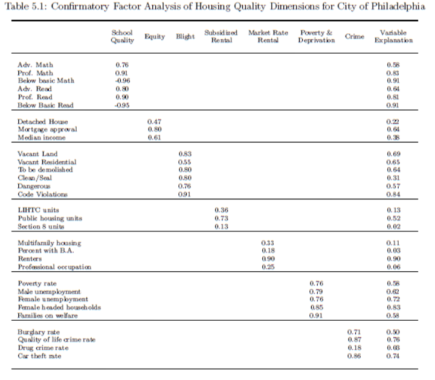

# Clustering Methods Considered

Clustering methods are useful to create subgroups of observations based on observable data. For example, housing submarkets can be revealed based on “clustered” characteristics shared by some neighborhoods and not by others

* These submarkets can provide a useful lens to view our region
  * Neighborhoods from across the region can better grasp their similarities and differences 
  * The diversity of neighborhoods can be visualized 
  * Policies and programs can be targeted to address neighborhood needs more efficiently

## Methods



### Factor Analysis \(and Principal Components Analysis\)

Often, a major component of datasets used for clustering are unobserved “latent” variables that are composed of many observed proxy variables

* For example, the latent variable of “housing quality,” a rather abstract concept that could be measured in various ways, is often proxied by many observable variables \(e.g. building material, code violations, surrounding vacancies, crime rate\) that researchers contend make up the components of “housing quality” 
* These latent variables can be estimated by using factor analysis \(FA\) – indeed, a number of housing submarket analyses perform a form of factor analysis before clustering 

**Why use FA?** The idea is that a measure composed of multiple individual indicators can explain an abstract concept like housing quality better than the indicators would individually \(e.g., by reducing measurement error\)

**How it’s used** \(example: Lisa K. Bates, 2006\): using confirmatory factor analysis, Bates defines “housing quality” as a construct containing 12 distinct dimensions – 5 individual indicators and 7 variables composed of multiple indicators. The factor scores estimated by CFA are then used as variables in the cluster analysis at the block group level.

Principal components analysis \(PCA\) is also used, but PCA and FA are different

* **FA** estimates factors, the underlying constructs \(e.g., “housing quality”\) that can’t be directly measured 
* **PCA** helps reduce the number of variables in a variable set to the “principal components,” which still explain the same amount of variance as the larger variable set, but with fewer variables – it’s primarily a variable reduction tool



### k-means clustering

Relatively common and easy-to-use clustering method

Steps:

* **Initiation**: k initial “means” are randomly generated within the data domain 
* **Expectation**: Data points are assigned to the nearest mean to form k clusters – “nearest” mean is measured by Euclidian distance \(the “assign” step\) 
* **Maximization**: The centroid of each of the k clusters becomes the new “mean” Why k-means? Because the mean of the Euclidian distances between each point in a cluster and the cluster “mean” is used to calculate the updated location of the centroid \(the “update” step\) 
* **Repeat Steps 2-3** until convergence into highly-defined clusters has been reached

**Pros:** Computationally efficient

**Cons:** The number of clusters k is an input parameter, chosen by the investigator; inappropriate choice of k can lead to poor results Poor handling of outliers \(logic: arithmetic means handle outliers worse than medians\) Tendency to produce equal-sized clusters can lead to bad results \(see below\)





### k-medians clustering

Similar to k-means in approach, but uses medians instead of means. This allows the algorithm to better handle outliers and noise than k-means \(just as medians are better at handling outliers than arithmetic means\) Here, the median determines the centroid, not the mean

**Pros:** Better handling of outliers than k-means \(logic: medians handle outliers better than arithmetic means\)

**Cons:** The number of clusters k is an input parameter, chosen by the investigator; inappropriate choice of k can lead to poor results



### k-medoids clustering

_\(used by Institute of Housing Studies at DePaul University for housing submarket analysis in Chicago – city and regional\)_

**Medoid** – the central-most point of a cluster; the object of a cluster whose average dissimilarity to all the objects in the cluster is minimal Unlike the means and medians used in k-means and k-median clustering, the medoid is an actual data point within the data set – the “most representative” point in a cluster More robust to noise and outliers than k-means Steps \(using Partitioning around Medoids \(PAM\) algorithm\): Initiation: select k of the n data points as medoids \(k is selected a priori\) Associate each data point with its closest Medoid \(the “assign” step\) For each medoid m and non-medoid point o, swap m and o, then assign data points to the closest swapped medoid \(o\) as in Step 2. If the “cost” of this new configuration \(the sum of pairwise dissimilarities\) is less than the cost with m as the medoid, then keep o as the new medoid and iterate this process until convergence. If the cost is more with o than with m as the medoid, then undo the swap. Iterate until convergence. \(the “update” step\) _\*\*_

**Pros:** Medoid is an actual instance from the dataset, unlike the means and medians used in k-means and k-medians clustering, making the algorithm more reliable for discrete data sets Better at finding clusters than k-means due to more rigorous “update” step

**Cons: T**he number of clusters k is an input parameter, chosen by the investigator; inappropriate choice of k can lead to poor results More computationally intensive than k-means



Despite starting at the same initial points, the k-means algorithm has trouble finding the clusters apparent in the data compared to the k-medoids algorithm.

k-means: 1a – 1f

k-medoids: 2a – 2h


The k-means algorithm asks “what is the centroid of the current cluster?” This question uses the mean of distances between the initial “mean” and the points within the cluster. The random location of the initial mean – and the distribution of the within-cluster distances from the mean – can heavily sway where the resulting centroid is placed \(since a number of outliers can heavily sway a mean in a way that they don’t sway medians or the medoid algorithm\). \(See Figure 1a-b for evidence of how the “outliers” of the upper right corner affect the brown and purple clustering decisions of the algorithm.\)

In the end, the k-means algorithm creates a pair of clusters where only one makes sense \(top left corner of data points\), and it combines what should be two clusters into one large cluster \(bottom left corner of data points\).

The k-medoids algorithm does a better job of handling the data points by asking “What data point minimizes the distance within the current cluster?” By keeping the algorithm tied to data points, it somewhat “restrains” where the updated medoid can be placed by naturally down-weighing outliers compared to closer points within a cluster. This more often results in “truer” and more representative clusters!



### Ward’s method

_\(used by Lisa K. Bates in housing submarket analysis of Philadelphia – city and regional\)_

A form of hierarchical clustering Agglomerative \(“bottom up”\): each data point starts as its own cluster, and clusters are merged as one moves higher up the hierarchy Divisive \(“top down”\): the entire dataset is one cluster, which is broken down into smaller clusters as you move down the hierarchy Ward’s method is a criterion used in agglomerative hierarchical clustering Goal: to minimize intra-cluster variance At each step, find the pair of clusters that leads to the minimum increase in the total within-cluster variance after merging

While Ward’s method generally involves the use of any objective function \(whichever is best for the investigator’s purposes\), the commonly known “Ward’s method” is Ward’s minimum variance method Objective function: minimize the error sum of squares \(the weighted sum of squares of differences between each average of y-values corresponding to the same x-value and the corresponding fitted y-values, the weight in each case being simply the number of observed y-values for that x-value.

•While Ward’s method generally involves the use of any objective function \(whichever is best for the investigator’s purposes\), the commonly known “Ward’s method” is Ward’s minimum variance method

Objective function in Ward’s minimum variance method: minimize the error of the squares

Error sum of squares – the weighted sum of squares of differences between each average of y-values corresponding to the same x-value and the corresponding fitted y-values, the weight in each case being simply the number of observed y-values for that x-value.

```text
            ****∑〖𝑤𝑒𝑖𝑔ℎ𝑡×〖\(𝑙𝑜𝑐𝑎𝑙 𝑎𝑣𝑒𝑟𝑎𝑔𝑒 −𝑓𝑖𝑡𝑡𝑒𝑑 𝑣𝑎𝑙𝑢𝑒\)〗^2 〗
```

\(In other words, for a given data point, find the average y values of the points clustered around the given data point, and compare it to the fitted y values, taking the difference. Square this difference \(square of error\), multiply it by a weight equal to the number of points clustered around the given data point, and take the sum of this calculation. Create clusters that minimize this sum!\)



### Latent transition analysis \(LTA\)

* Shows how members move across classes over time
  * Could be useful to see how neighborhoods have changed from one typology to another \(instead of using variables of change \(e.g., change in home values\) to encapsulate neighborhood change into a single cross-sectional look at the current neighborhood typology\)
* requires longitudinal data
* [Penn State University has great technical resources on this](https://methodology.psu.edu/ra/lta)



## Example



### Lisa K. Bates, Philadelphia \(city & metropolitan area\)

**Goal:** segment the housing market by product type and quality in a way that allows a prediction of house prices. Bates does this by examining “the dimensions of housing quality that segment the housing market”

> “Housing quality is a multi-dimensional construct that is best represented as a set of latent variables.”

Bates uses a two-part process:



Constructing a “housing quality” construct out of observable variables using confirmatory factor analysis

**Geography**: block group level for city of Philadelphia

**Estimates** “twelve distinct dimensions to the housing quality concept” _\(**bold** = latent variables constructed via CFA\)_

|  | Dimensions |
| :---: | :--- |
| **1** | **Wealth and home equity** |
| **2** | **Physical blight** |
| **3** | **Market rate renters** |
| **4** | **Subsidized renters** |
| **5** | **Poverty and deprivation** |
| **6** | **Crime** |
| **7** | **School quality** |
| 8 | Non-residential land uses \(commercial and industrial, measured as two separate indicators\) |
| 9 | Racial demographics \(proportion of block group that is black – reflects household preferences for racial heterogeneity or homogeneity in their housing choices\) |
| 10 | Building type \(proportion of rowhouses\) |
| 11 | Neighborhood change indicators \(house price appreciation and population change\) |
| 12 | Access to central business district \(distance of block group to Center City\) |



Using Ward’s method to cluster neighborhoods based on the latent and observable variables measured in part 1.

* Factor scores and observable variables are assigned for each block group 
* These factor scores are entered into Ward’s method for hierarchical clustering









## Evaluation and assessment



* Clustering is evaluated based on the data of the clustering itself 
* Helps to determine effectiveness of the clustering, but not whether the clusters are valid. Internal evaluation does not tell us whether our clusters are true to the world, only whether the clustering was “done well” 
* Main criteria: cluster method that produces clusters with high similarity within clusters and low similarity between clusters are highly rated
* Methods _\*\*_
  * Silhouette 
    * value between -1 and +1, with values closer to +1 suggesting good clustering and values closer to -1 suggesting that a data point should be in a neighboring cluster. 0 suggests values on border of two clusters 
    * Useful for helping determine the number of natural clusters in the data – too many or too few clusters will be reflected in the average silhouette value of the entire dataset 
  * Other methods: Dunn Index; Davies-Bouldin index



* Clustering validity is tested based on comparing the clustering results – the “training” data, if you will – to data that has already been labeled by class – the “test” data, if you will 
  * A machine learning approach – comparing training data to test data in order to see how well your clustering algorithm can predict the results of the test dataset. 
  * Perhaps useful if you have a decent number of neighborhoods already labeled by class, but you have a large amount of observations that are unlabeled by class but have other variables necessary to estimate what class they will belong to 
  * Requires a large dataset that will allow you to partition your data into a training and a test dataset
  * Manual evaluation Often will involve human expert assessment of the clustering results Subjective, but relies on human experience to assess whether clustering results are valid Very valuable form of assessment, especially because it allows for participatory research opportunities with those in communities that are being classified



* Often will involve human expert assessment of the clustering results 
* Subjective, but relies on human experience to assess whether clustering results are valid 
* Very valuable form of assessment, especially because it allows for participatory research opportunities with those in communities that are being classified



* Simply asks: Is this clustering analysis even useful? Do people understand it, and can it be used for the intended purpose? 
* Internal and external stakeholder conversations are invaluable as early in the process as possible to help make the analyses useful when the end product is produced



## Conclusion

Factor analysis may be a useful first step in capturing abstract concepts such as housing quality in our analysis. Several clustering methods have been used to create subgroups from observable data

* k-means, k-medoids and Ward’s method have been used in various published housing submarket analyses 
  * k-medoids seems to be more rigorous than k-means 
* Several forms of evaluation and assessment should be used to assess clustering effectiveness, validity, and usefulness

|  |  |
| :--- | :--- |
| k-means | [https](https://www.datanovia.com/en/lessons/k-means-clustering-in-r-algorith-and-practical-examples/)[://](https://www.datanovia.com/en/lessons/k-means-clustering-in-r-algorith-and-practical-examples/)[www.datanovia.com/en/lessons/k-means-clustering-in-r-algorith-and-practical-examples/](https://www.datanovia.com/en/lessons/k-means-clustering-in-r-algorith-and-practical-examples/) \(includes R code for implementation\) |
| k-means | [https](https://www.coursera.org/lecture/cluster-analysis/3-4-the-k-medoids-clustering-method-nJ0Sb)[://](https://www.coursera.org/lecture/cluster-analysis/3-4-the-k-medoids-clustering-method-nJ0Sb)[www.coursera.org/lecture/cluster-analysis/3-4-the-k-medoids-clustering-method-nJ0Sb](https://www.coursera.org/lecture/cluster-analysis/3-4-the-k-medoids-clustering-method-nJ0Sb) \(also includes information on k-medoids, k-medians, and others\) |
| k-medoids | [https](https://www.datanovia.com/en/lessons/k-medoids-in-r-algorithm-and-practical-examples/)[://www.datanovia.com/en/lessons/k-medoids-in-r-algorithm-and-practical-examples](https://www.datanovia.com/en/lessons/k-medoids-in-r-algorithm-and-practical-examples/)[/](https://www.datanovia.com/en/lessons/k-medoids-in-r-algorithm-and-practical-examples/) \(includes R code for implementation\) |
| Ward’s method | \[[https://www.stat.cmu.edu/~cshalizi/350/lectures/08/lecture-08.pdf](https://www.stat.cmu.edu/~cshalizi/350/lectures/08/lecture-08.pdf) |

\]\([https://www.stat.cmu.edu/~cshalizi/350/lectures/08/lecture-08.pdf](https://www.stat.cmu.edu/~cshalizi/350/lectures/08/lecture-08.pdf) \) \| \| Ward’s method \| [https://arxiv.org/pdf/1111.6285.pdf ](https://arxiv.org/pdf/1111.6285.pdf%20) \| \| \(LCA\) and \(LTA\) \| [https://methodology.psu.edu/ra/lca/teacherscorner ](https://methodology.psu.edu/ra/lca/teacherscorner%20) \|

