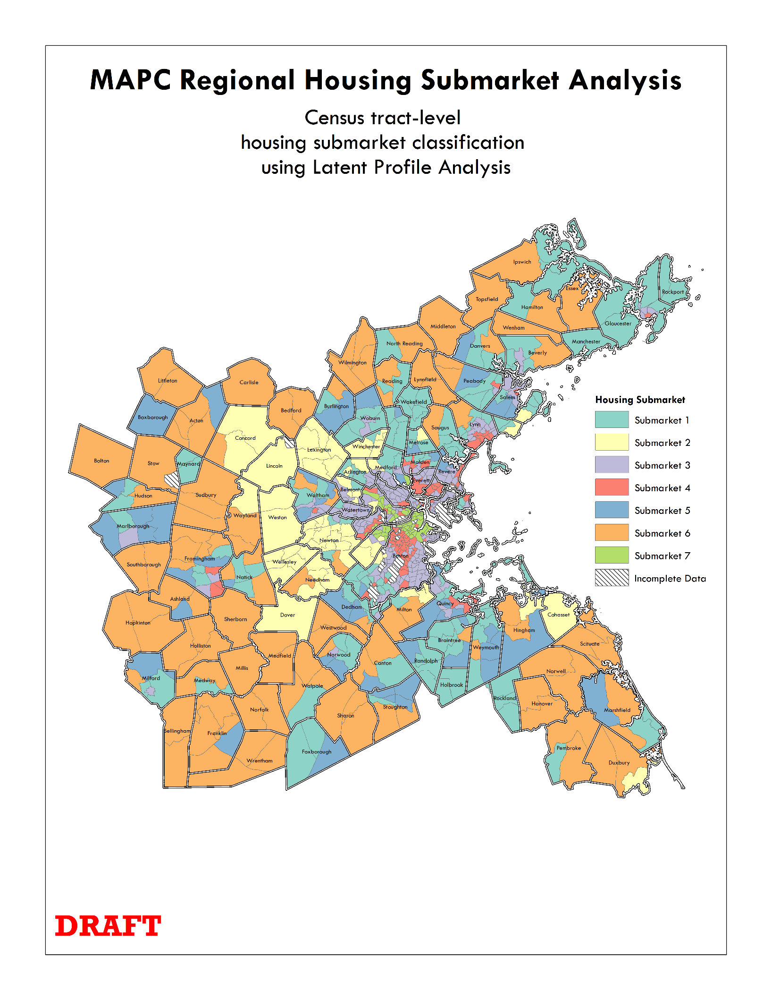
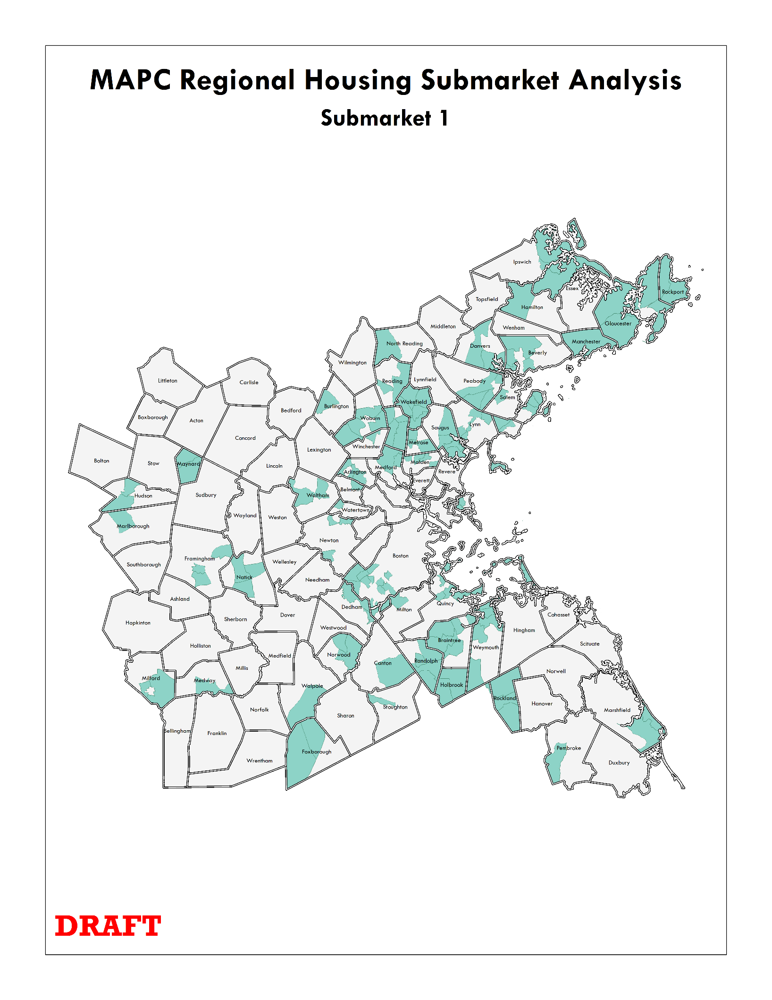
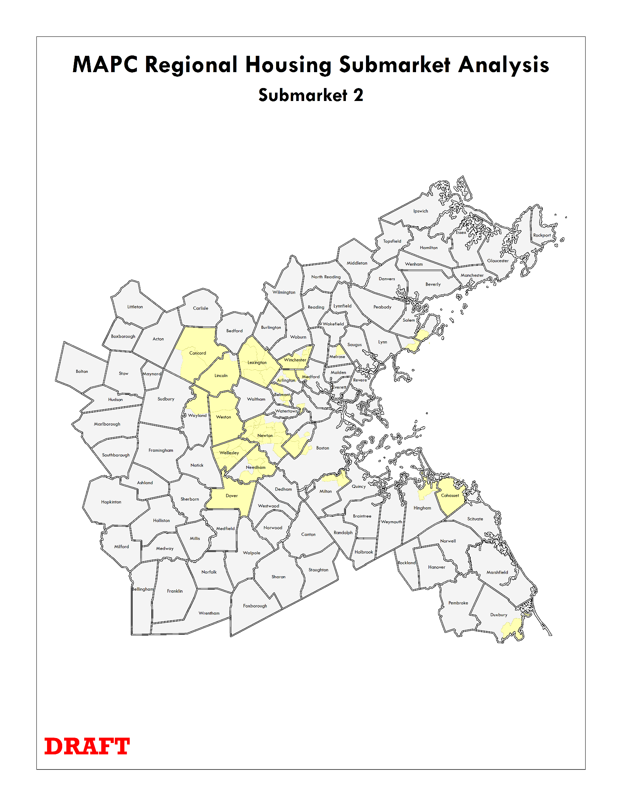
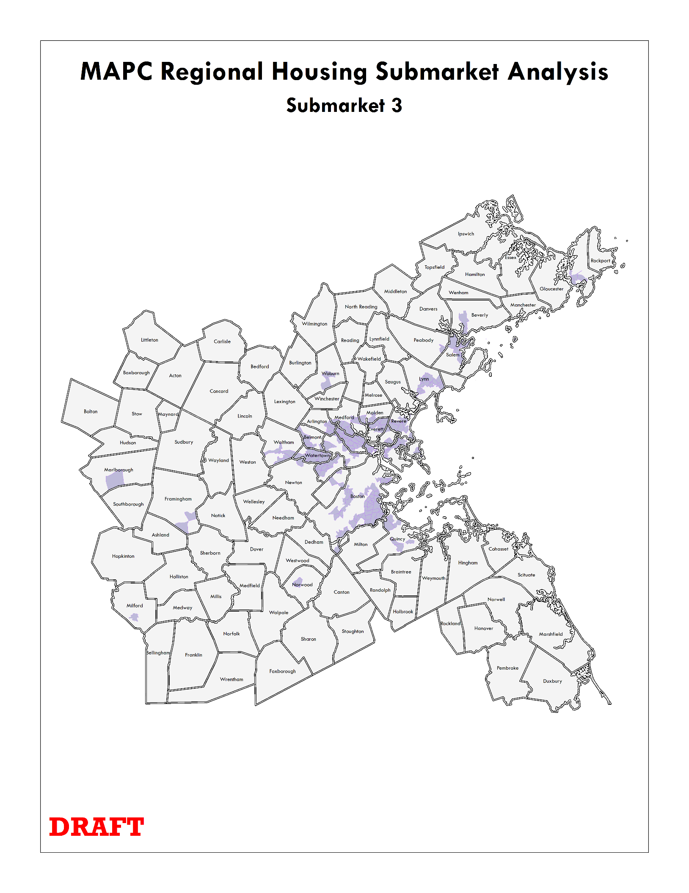
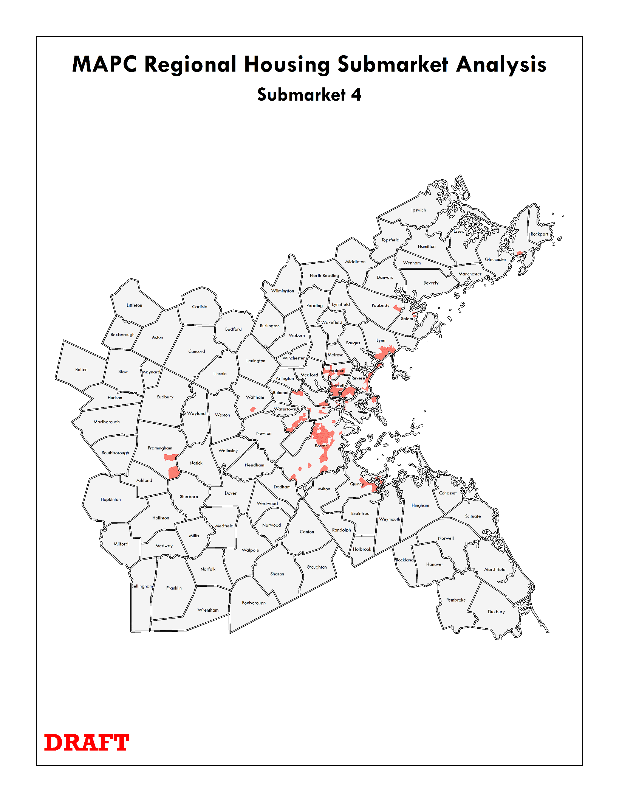
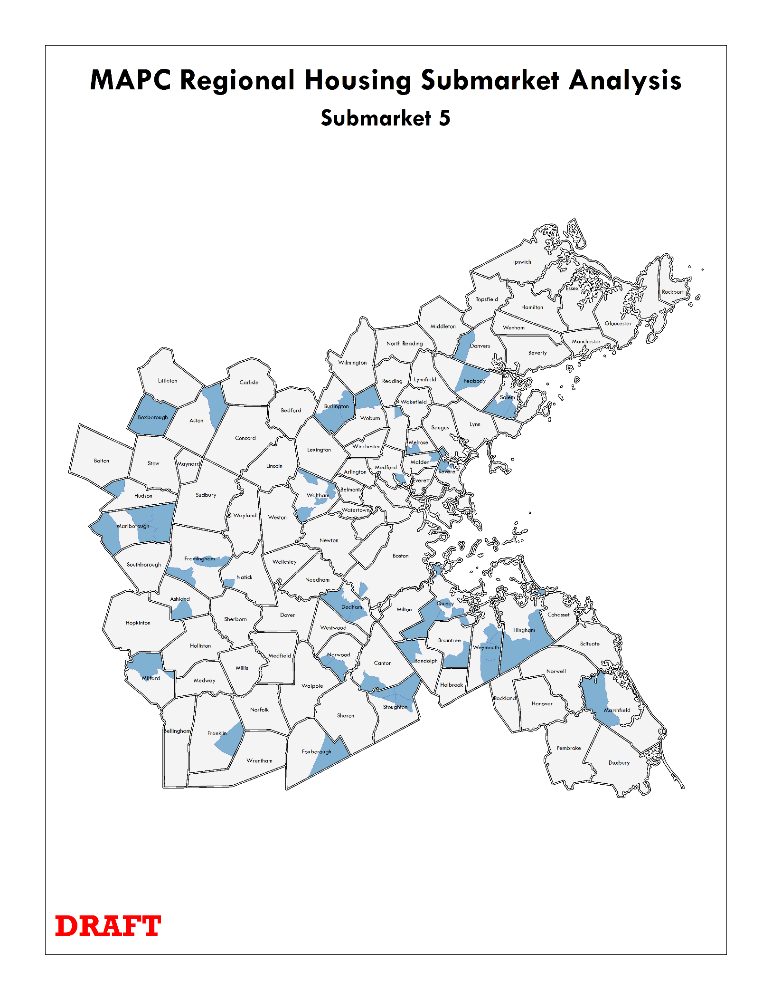
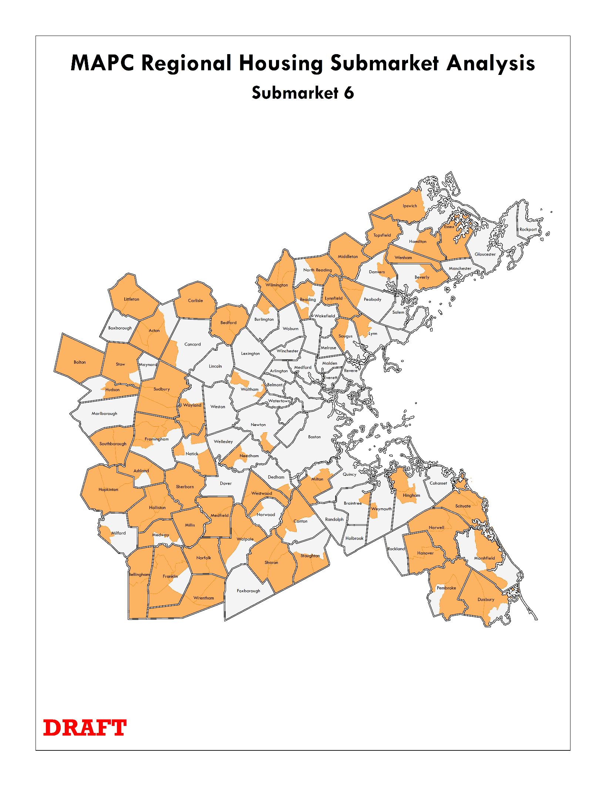
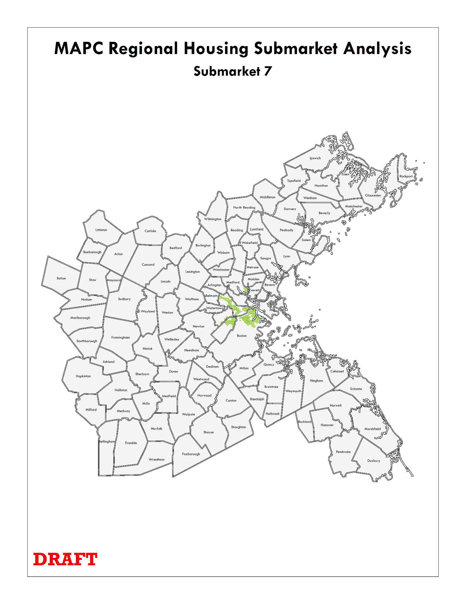

# MAPC Housing Submarket Typology Analysis

**Introduction**

Urban and regional planners, policymakers, housing and community development advocates, and more depend on community knowledge and data to plan and implement development strategies, revitalization programs, and other neighborhood-centric policies and interventions. However, neighborhoods selected for such efforts may be targeted in isolation or alongside neighboring communities under the assumption that spatially clustered neighborhoods may experience parallel, intended policy effects. In reality, similar neighborhoods, sharing common challenges and opportunities, may exist throughout the region in a spatially heterogeneous manner, while nearby neighborhoods may actually have vastly different characteristics that could result in unintended policy impacts.

One approach to categorizing neighborhoods that could account for these issues is housing submarket segmentation. Housing submarkets are distinct market segments based on similarities in housing market demographics, socioeconomic data, housing characteristics, and more. An analysis of housing submarkets in our region will be valuable in several ways. A submarket framework can better facilitate the development of policy responses and community development strategies that are tailored to specific submarkets facing unique challenges and opportunities. Additionally, such an analysis can give rise to targeted research that is more relevant to a given submarket or set of submarkets, such as mapping populations vulnerable to residential displacement.

The overall goal of this study was to develop a regional housing submarket typology for Greater Boston. To accomplish this goal, we produced a novel dataset incorporating building stock, housing market, and neighborhood environment information from the U.S. Census Bureau, the Warren Group real estate and mortgage database, and the U.S. Department of Housing and Urban Development. We then compared two well-studied clustering techniques – latent profile analysis \(LPA\) and _k_-medoids – in order to cluster census tracts throughout the region into housing submarket types. Ultimately, we identified seven housing submarkets that are distinct enough from one another to signify significant differences in micro-level housing market characteristics. Our findings provide a valuable tool that planners, policymakers, researchers, and others can use to develop appropriate, targeted programs, policies, and research efforts for the range of neighborhood types that may exist within a given municipality or across the region.

**Research methods and data**

_Study area and data_

The data for this study were drawn from four sources: the U.S. Census Bureau’s American Community Survey \(ACS\) 5-year estimates from 2013-2017, the 2000 U.S. Decennial Census, the Warren Group real estate and mortgage database, and the U.S. Department of Housing and Urban Development \(HUD\). Data were collected for the 706 census tracts within the 101 municipalities comprising the MAPC region and standardized to 2010 census tract boundaries using Brown University’s Longitudinal Tract Data Base \(LTDB\). After removing census tracts with missing data, no population, or zero housing units, 681 census tracts remained and were included in the final analyses.

Housing market demographics, contract rent, and housing density were collected from both the 2000 US Decennial Census and ACS 2013-2017 5-year sample estimates; these variables were used to describe current conditions \(ACS data\) or a change in conditions from the year 2000. Household income, vacancy rates, and housing characteristics \(e.g., housing stock age\) were drawn from ACS 2013-2017 data. The share of subsidized housing units in a given tract were calculated using data from HUD. Median home value and housing sales characteristics \(e.g., the percent of residential sales purchased by a business\) were drawn from property data collected by The Warren Group, a New England-based real estate and mortgage data tracking company. Table 1 provides a list of the variables used in the submarket analysis, along with associated descriptive statistics. Data sources, variable calculations, and other metadata are included in the appendix.

_Clustering techniques_

Latent Profile Analysis

Latent Profile Analysis \(LPA\) is a statistical classification technique that sorts individuals into unobserved, or “latent,” classes based on observed continuous variables. LPA is a useful procedure for describing relatively homogeneous subgroups within a larger heterogeneous population.[\[1\]]()

Latent profile analysis has many distinct advantages over traditional clustering analysis techniques \(see Wang and Hanges \(2011\) for extended discussion\). First, LPA is a probabilistic classification procedure, meaning that each individual’s probability of being a member of any given class is explicitly computed – as is the level of uncertainty. The probability of class membership is based on an individual’s values for the observed variables used in the analysis. By extension, any _additional_ individuals from the population not included in the initial analysis can be probabilistically assigned to a class based on its observed variables – a benefit not possible with many traditional clustering techniques. Secondly, variables on different scales do not need to be standardized or transformed prior to conducting LPA. Lastly, model fit criteria for LPA models are less arbitrary and more statistically rigorous than those of traditional cluster analysis, owing in part to the use of the maximum-likelihood method of estimating model parameters in LPA.[\[2\]]()

In this study we tested several different LPA models, each distinguished by the number of clusters assessed and the parameterization of the variance-covariance matrix. Starting with a one-class model and adding a latent class to each successive model, we estimated solutions for up to nine classes. All models were estimated with R version 3.5.0 software; R packages “mclust” version 5.4.3 and “tidyLPA” version 1.0.2 were used to conduct the analysis.

We then substantially reduced the number of possible profile solutions using model fit criteria and substantive considerations from internal stakeholders knowledgeable about regional housing dynamics. Ultimately, we chose the 7-class LPA solution with a class-invariant, diagonal variance-covariance matrix structure[\[3\]]() as the best LPA model.

_Determining the number of classes_

We examined nine model fit statistics to evaluate candidate profile solutions: Log likelihood \(LL\), Akaike’s Information Criterion \(AIC\), consistent AIC \(CAIC\), Bayesian Information Criterion \(BIC\), sample-size adjusted BIC \(SABIC\), Approximate Weight of Evidence Criterion \(AWE\), entropy, and the bootstrap likelihood ratio test \(Bootstrap LRT\). Model fit criteria for LPA and other finite mixture models are extensively discussed in articles by Masyn[\[4\]]() and Nylund, Asparouhov, and Muthén.[\[5\]]() Generally, the optimal LPA model has lower values of AIC, CAIC, BIC, SABIC, and AWE relative to other candidate models; a higher value of entropy compared to other candidate models; and a statistically significant BLRT \(p &lt; 0.05\). Parsimony \(i.e. choosing fewer rather than a greater numbers of classes\) and substantive considerations \(i.e. theory and/or subject matter expertise\) should be used to choose the best model when comparing candidate solutions with similar model fit statistics and differing numbers of classes.

Model fit criteria were calculated for models of 1 to 9 classes across four variance-covariance parameterizations: class-invariant, diagonal \(hereafter referred to as model parameterization A\); class-varying, diagonal \(B\); class-invariant, unrestricted \(C\); and class-varying, unrestricted \(D\). For model parameterizations B and D, the models failed to converge after 4 and 3 classes, respectively, for all model fit criteria. Based on internal stakeholder conversations, these 4- and 3- class models failed to adequately represent the diversity of housing submarkets in the region and were therefore dropped from further analysis. For model parameterizations A and C, the models converged for all tested class sizes, but model fit failed to demonstrably improve after 7 classes. Therefore, the 7-class class-invariant, diagonal \(A\) and 7-class class-invariant, unrestricted \(C\) models were chosen as the top two candidate LPA models based on fit criteria. After additional internal stakeholder discussions, the 7-class class-invariant, diagonal \(A\) model was ultimately selected as the most representative submarket clustering model of all candidate LPA solutions.

**Table 1.** Descriptive Statistics

| Variable | Mean | Std Dev | Min | Max |
| :--- | :--- | :--- | :--- | :--- |
| Housing Unit Density \(units per square mile\) | 5,265.6 | 7,206.5 | 88.2 | 59,345.5 |
| Median Household Income \($\) | 89,968.3 | 37,650.2 | 16,094 | 228,438 |
| Households with Income 0-35K \(%\) | 23.4 | 12.9 | 2.6 | 74.9 |
| Households with Income 35-75K \(%\) | 22.7 | 7.5 | 5.4 | 45.5 |
| Households with Income 75-100K \(%\) | 11.4 | 4.2 | 1.5 | 23.2 |
| Households with Income 100K + \(%\) | 42.5 | 17.3 | 4.8 | 81.7 |
| Households with Income 150K+ \(%\) | 24.8 | 15.2 | 0 | 68.7 |
| Median Contract Rent \($\) | 1,301.9 | 476.1 | 0 | 3,297 |
| Median Home Value \($\) | 560,761.9 | 240,372.7 | 147,000 | 1,899,000 |
| Renter-Occupied Housing Units \(%\) | 42.7 | 24.2 | 1.8 | 98.1 |
| Residential Sales Purchased by Business Buyers \(%\) | 13.3 | 10.1 | 0 | 80 |
| Residential Foreclosure Activity \(%\) | 2.6 | 3.2 | 0 | 20 |
| Cash Sales \(%\) | 22.7 | 10.7 | 0 | 83.3 |
| Change in Residential Home Sales from 2003-2007 to 2012-2016 \(%\) | -11.1 | 18.6 | -66.3 | 117.9 |
| Vacant Units \(%\) | 6.1 | 4.1 | 0 | 29.4 |
| HUD Subsidized Housing Units \(%\) | 2.7 | 6.4 | 0 | 54.6 |
| Three-Bedroom Units \(%\) | 51.2 | 21.6 | 1.9 | 95.8 |
| Units Built 1959 or Earlier \(%\) | 58 | 21.2 | 4 | 95.6 |
| Units Built 1960-1999 \(%\) | 33.4 | 18 | 3.3 | 88.5 |
| Units Built 2000 or Later \(%\) | 8.6 | 8.3 | 0 | 55 |
| 1 Unit \(%\) | 47.7 | 30 | 0 | 100 |
| 2-4 Units \(%\) | 25.9 | 21.8 | 0 | 87.6 |
| 5+ Units \(%\) | 26.1 | 22.8 | 0 | 99.2 |
| Change in Median Home Value \(%\) | 48.6 | 48.4 | -43.8 | 753.8 |
| Change in Median Contract Rent \(%\) | 18.8 | 39.3 | -100 | 421.2 |
| Change in Renters \(%\) | 3.4 | 43.4 | -85.6 | 634.2 |
| Change in Population \(%\) | 9.7 | 16.8 | -22 | 166.4 |
| Change Housing Unit Density \(%\) | 43.8 | 129.1 | -32.1 | 1,652.2 |
|  |  |  |  |  |
|  |  |  |  |  |

**Table 2**. Summary of submarket characteristics – model-based means for each submarket \(Latent Profile Analysis\)

|  | Submarket |  |  |  |  |  |  |
| :--- | :--- | :--- | :--- | :--- | :--- | :--- | :--- |
| Variable | 1 | 2 | 3 | 4 | 5 | 6 | 7 |
| Housing Unit Density \(units per square mile\) | 1,815 | 1,445 | 7,281 | 8,685 | 1,406 | 460 | 20,461 |
| Median Household Income \($\) | 85,804 | 158,341 | 75,029 | 38,689 | 80,475 | 124,494 | 92,411 |
| Households with Income 0-35K \(%\) | 20.1 | 11.3 | 25.2 | 48.1 | 22.4 | 12.5 | 23.9 |
| Households with Income 35-75K \(%\) | 24.5 | 12.3 | 26.8 | 26.7 | 25.2 | 17.0 | 19.6 |
| Households with Income 75-100K \(%\) | 13.5 | 8.1 | 12.8 | 8.1 | 13.4 | 10.4 | 10.0 |
| Households with Income 100K + \(%\) | 41.8 | 68.2 | 35.3 | 17.2 | 38.9 | 60.1 | 46.5 |
| Households with Income 150K+ \(%\) | 22.1 | 51.3 | 17.3 | 7.0 | 20.4 | 39.1 | 29.4 |
| Median Contract Rent \($\) | 1,152 | 1,718 | 1,345 | 985 | 1,444 | 1,106 | 1,870 |
| Median Home Value \($\) | 444,958 | 973,283 | 554,092 | 465,220 | 391,778 | 521,904 | 825,377 |
| Renter-Occupied Housing Units \(%\) | 28.7 | 19.0 | 57.0 | 77.2 | 42.4 | 13.1 | 66.5 |
| Residential Sales Purchased by Business Buyers \(%\) | 10.5 | 14.1 | 15.2 | 18.8 | 9.1 | 9.3 | 16.9 |
| Residential Foreclosure Activity \(%\) | 3.1 | 0.7 | 2.6 | 4.1 | 3.7 | 2.4 | 0.4 |
| Cash Sales \(%\) | 19.9 | 21.8 | 20.3 | 28.4 | 22.7 | 18.5 | 38.9 |
| Change in Residential Home Sales from 2003-2007 to 2012-2016 \(%\) | -3.8 | 0.5 | -17.4 | -28.4 | -10.0 | 0.6 | -20.8 |
| Vacant Units \(%\) | 5.9 | 5.2 | 6.3 | 7.0 | 5.3 | 3.8 | 10.6 |
| HUD Subsidized Housing Units \(%\) | 1.0 | 0.6 | 1.7 | 11.6 | 0.8 | 0.9 | 4.7 |
| Three-Bedroom Units \(%\) | 59.8 | 77.1 | 41.8 | 29.9 | 43.9 | 77.1 | 17.5 |
| Units Built 1959 or Earlier \(%\) | 61.2 | 66.6 | 75.0 | 56.8 | 30.3 | 34.5 | 61.4 |
| Units Built 1960-1999 \(%\) | 32.7 | 25.2 | 20.0 | 32.9 | 53.8 | 53.7 | 27.5 |
| Units Built 2000 or Later \(%\) | 6.1 | 8.2 | 5.0 | 10.3 | 16.0 | 11.8 | 11.1 |
| 1 Unit \(%\) | 66.2 | 77.1 | 25.3 | 15.8 | 50.1 | 86.0 | 8.2 |
| 2-4 Units \(%\) | 17.5 | 12.7 | 53.3 | 32.8 | 10.1 | 4.6 | 20.2 |
| 5+ Units \(%\) | 15.8 | 10.2 | 21.3 | 51.0 | 39.2 | 8.9 | 71.5 |
| Change in Median Home Value \(%\) | 31.9 | 36.9 | 64.9 | 84.0 | 27.2 | 17.7 | 81.1 |
| Change in Median Contract Rent \(%\) | 10.3 | 18.5 | 24.1 | 15.7 | 27.5 | 12.0 | 34.5 |
| Change in Renters \(%\) | -2.4 | 1.5 | -5.4 | 1.0 | 47.8 | 11.0 | -5.4 |
| Change in Population \(%\) | 4.3 | 7.0 | 7.7 | 12.5 | 18.0 | 9.6 | 21.4 |
| Change Housing Unit Density \(%\) | 18.9 | 19.3 | 38.5 | 59.2 | 55.6 | 31.1 | 145.7 |
| Count | 143 | 60 | 180 | 78 | 55 | 112 | 53 |
| Proportion | 0.21 | 0.09 | 0.26 | 0.11 | 0.08 | 0.16 | 0.08 |
|  |  |  |  |  |  |  |  |
|  |  |  |  |  |  |  |  |

**Table 3**. Fit Statistics for Latent Class Analysis Profiles \(Class-Invariant, Diagonal Model\)

| Classes | LL | AIC | AWE | BIC | CAIC | Entropy | BLRT \(_p_\) |
| :--- | :--- | :--- | :--- | :--- | :--- | :--- | :--- |
| 1 | -98214.6 | 196541.1 | 197325.8 | 196794.5 | 196850.5 | 1 | NA |
| 2 | -95970.5 | 192110.9 | 193303 | 192495.4 | 192580.4 | 0.955626 | 0.009901 |
| 3 | -95161.3 | 190550.5 | 192150 | 191066.2 | 191180.2 | 0.943141 | 0.009901 |
| 4 | -94311.1 | 188908.3 | 190915.1 | 189555.1 | 189698.1 | 0.956014 | 0.009901 |
| 5 | -93770.7 | 187885.3 | 190299.5 | 188663.4 | 188835.4 | 0.956939 | 0.009901 |
| 6 | -93470.6 | 187343.2 | 190164.8 | 188252.4 | 188453.4 | 0.949103 | 0.009901 |
| 7 | -93229.8 | 186919.5 | 190148.5 | 187960 | 188190 | 0.950698 | 0.009901 |
| 8 | -92528.8 | 185575.6 | 189211.8 | 186747.2 | 187006.2 | 0.965318 | 0.009901 |
| 9 | -92294.7 | 185165.3 | 189209 | 186468.1 | 186756.1 | 0.964846 | 0.009901 |

_Note_. LL = Log likelihood; AIC = Akaike’s Information Criterion; AWE = Approximate Weight of Evidence Criterion; BIC = Bayesian Information Criterion; CAIC = Consistent Akaike’s Information Criterion; BLRT = Bootstrapped Log Likelihood Ratio Test

Suburban and regional urban centers; low density, lower cost, older housing stock; moderate household income; minimal change

Latent Profile Analysis

Suburban; low-density, older housing stock; high home prices and rents; high income; minimal change

Latent Profile Analysis

Primarily inner core; moderate density, oldest housing stock; low/moderate household income; increasing home values and rents, decreasing renters

Latent Profile Analysis

Primarily inner core; high density, lower cost, mixed-age housing stock; lowest household income; high foreclosure, business buyers, and cash sales; greatest increase in home value; increasing population and density

Latent Profile Analysis

Suburban and regional urban centers; low density, newest housing stock; lowest home values; high foreclosure; increases in rent, renters, population, and density

Latent Profile Analysis

Suburban; lowest density, newer moderate-cost housing stock; very high household income; most stable pre-/post-recession residential sales activity; minimal change

Latent Profile Analysis

Inner core; highest density, high-cost older housing stock; moderate household income; highest rents, vacancy, and cash sales rate; increasing home values, rent, population, and density; decreasing renters

Latent Profile Analysis

1. 
